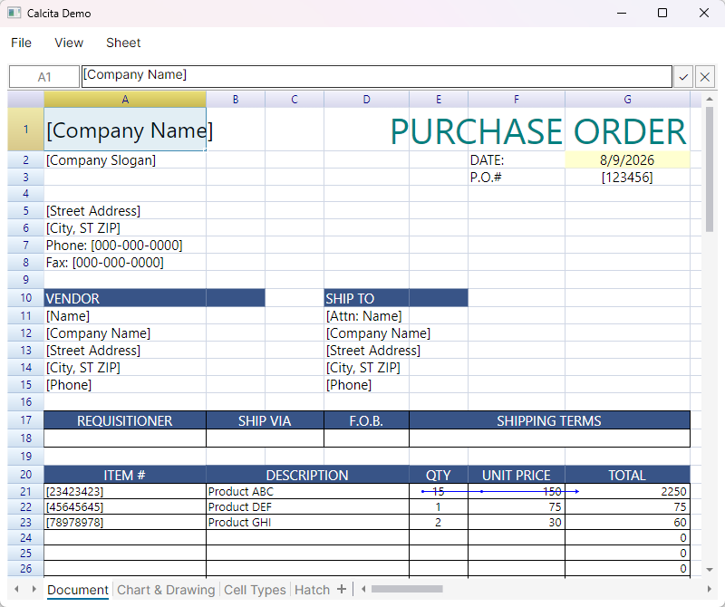

# Calcita

Calcita is a fork and independent development of the open-source .NET spreadsheet component ReoGrid. This repository contains the Calcita project which started from ReoGrid's codebase and will evolve separately.

- Project: `Calcita` (derived from ReoGrid)
- Original project: ReoGrid — https://reogrid.net

## Usage

1. Reference the package

   ```powershell
   dotnet add package Calcita.Avalonia
   ```

2. Add the style (required)

   In `App.axaml`, add the Calcita styles after your theme:

   ```xml
   <Application.Styles>
       <FluentTheme />
       <StyleInclude Source="avares://Calcita/Avalonia/Theme/Styles.axaml"/>
   </Application.Styles>
   ```

3. Put a `CalcitaControl` in your window and bind a `Calcita.Workbook` to it

   ```xml
   <Window xmlns="https://github.com/avaloniaui"
           xmlns:x="http://schemas.microsoft.com/winfx/2006/xaml"
           xmlns:rg="clr-namespace:Calcita.Controls;assembly=Calcita"
           ...>
       <rg:CalcitaControl Workbook="{Binding Workbook}" FormulaBarVisible="True" />
   </Window>
   ```

# About

Calcita aims to provide a lightweight, modernized .NET spreadsheet component based on ReoGrid. Early versions keep much of the original functionality and snapshots, while future commits will introduce Calcita-specific features and refactors.

This is a hobby / side project.  
I maintain it in my free time, so updates may not be very frequent.

**However, contributions are very welcome!**  
Feel free to submit issues or pull requests. I'll review them as soon as I can.

# Documentation

The original ReoGrid documentation is available at:

https://reogrid.net/document

Calcita-specific documentation will be added as the project matures.

# Snapshots



# License & Attribution

This project is based on ReoGrid. The original project is licensed under the MIT License.

MIT License

Copyright (c) Jingwood & unvell.com 2012-2019.

Calcita continues under the same MIT terms for code derived from ReoGrid. Any new code added in this repository by the Calcita authors will also be published under the MIT License unless otherwise stated.

If you are using or redistributing this code, please respect the original authors' attribution and the licensing terms.
